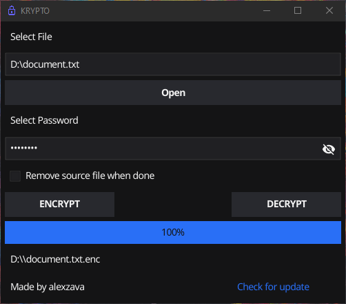

# KRYPTO

```
█▄▀ █▀█ █▄█ █▀█ ▀█▀ █▀█
█░█ █▀▄ ░█░ █▀▀ ░█░ █▄█
```

Simple and secure files encryption tool.



## How to use

**Encrypt**
```
krypto -e <inputfile>
```

**Decrypt**
```
krypto -d <inputfile>
```

**-del** to overwrite and remove the file when done

**-cli** to use CLI mode

## How does it work?

Krypto uses AES-CTR with a key length of 256bit and HMAC-SHA3 (256bit key | 512bit digest) for Encrypt-then-Mac operation as authenticated encryption.

* Generate random *iv* (16 byte) for encryption
* Generate random *salt* (16 byte) for *master key*
* Genereate a *master key* (32 bytes) from user password using Argon2id
* Derive *encryption key* (32 byte) from *master key* using HKDF-SHA3
* Derive *mac key* (32 byte) from *master key* using HKDF-SHA3
* Encrypt with AES-CTR
* Calculate *tag* with HMAC-SHA3

## License

This project is licensed under the Apache License 2.0 - see the [LICENSE](LICENSE) file for details.

---

**Krypto is a personal project for educational purposes, the code has not been independently audited.**